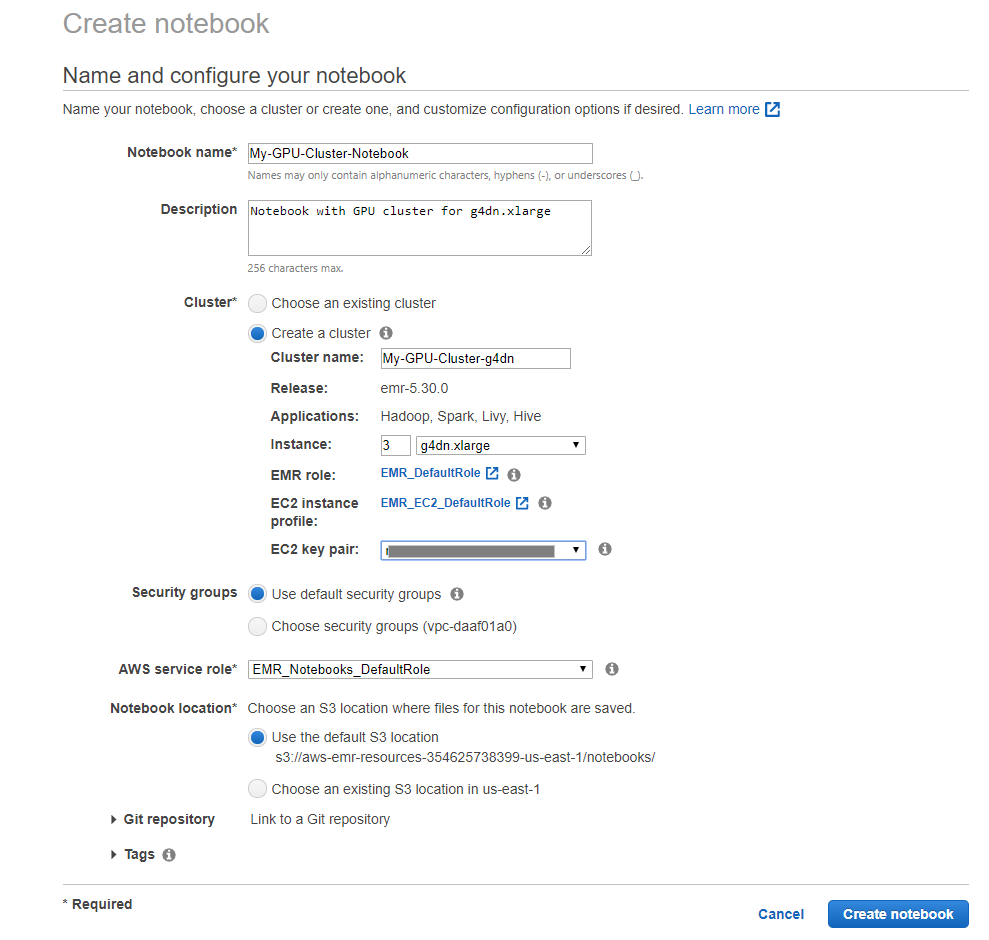
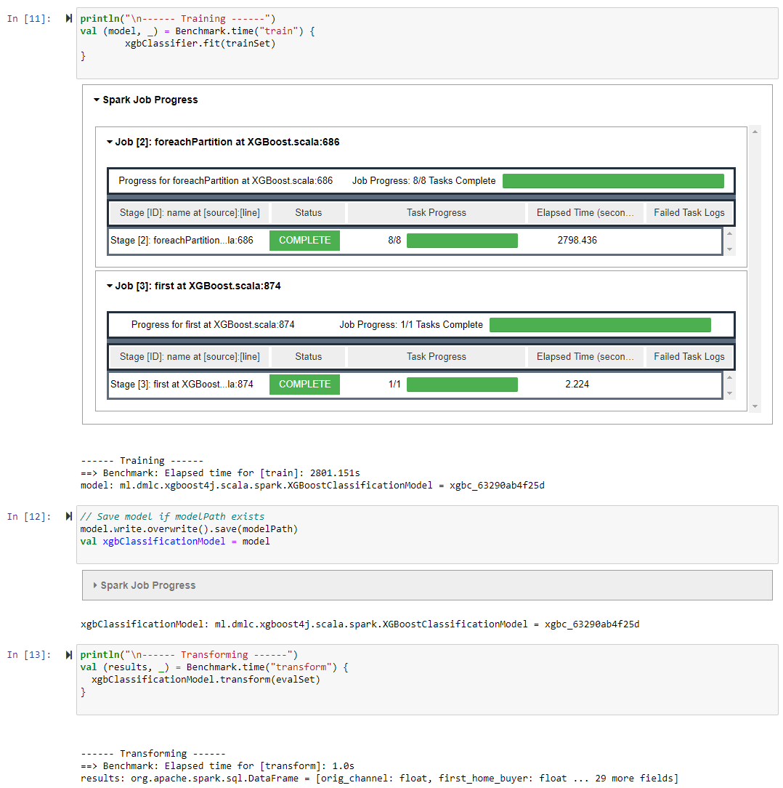

# Get Started with GPU Accelerated Spark Using AWS EMR Notebook

You can use the following step-by-step guide to run the example mortgage dataset using open source XGBoost library on Amazon EMR GPU clusters.  For more examples, please refer to https://github.com/NVIDIA/spark-xgboost-examples/tree/spark-2

An EMR Notebook is a "serverless" Jupyter notebook. Unlike a traditional notebook, the contents of an EMR Notebook itself—the equations, visualizations, queries, models, code, and narrative text—are saved in Amazon S3 separately from the cluster that runs the code. This provides an EMR Notebook with durable storage, efficient access, and flexibility.

For more information, please go to https://docs.aws.amazon.com/emr/latest/ManagementGuide/emr-managed-notebooks.html


## Launch GPU Cluster with EMR Notebook for Mortgage Small Dataset (200M)

### Step 1:  Create EMR Notebook and Cluster using Amazon EMR GUI

Go to the AWS Management Console and select the Amazon EMR service from the "Analytics" section. Choose the region you want to launch your cluster in, typically in the same region as your Amazon S3 bucket where you store large training datasets. Select Notebooks on the left column and click the Create notebook button. In the detailed configuration page, you can create a new cluster with notebook instances by setting the GPU node. In this example, we add three Amazon EC2 g4dn.xlarge GPU nodes to the new cluster. 




### Step 2:  Run Open Source XGBoost Library and Mortgage Examples on Amazon EMR Notebook

Once the cluster is ready, go to the Amazon EMR Notebooks, click on the Amazon Notebook instance, and click Open in Jupyter. Start the Amazon Notebook instance if it is not running.

Please download this example notebook [EMR_Mortgage_Example_G4dn.ipynb](EMR_Mortgage_Example_G4dn.ipynb) from Github and upload to the Amazon EMR Notebook instance.  More Scala example code can be found [here](../../../examples/notebooks/scala/).

Now enter the mortgage example notebook to run the GPU accelerated Apache Spark code on Open Source XGBoost library towards a small mortgage dataset on Amazon S3.  If the notebook kernel is not set to Apache Spark, please go to Kernel -> Change Kernel to set Apache Spark as the kernel. The Amazon EMR notebook is talking to the Amazon EMR cluster running Apache Spark using Apache Livy as shown in the below diagram.


###  Step 3: Customize Your Spark Job Configurations

You can always customize your Apache Spark job configurations such as number of executors, number of cores, and executor memory base on your GPU cluster.  Each GPU maps to one executor. 

###  Step 4: View the training and transform results and benchmark

In the Amazon EMR Notebook, you can view the Apache Spark job progress visually and the benchmark results. The trained model can be saved to a local folder or Amazon S3 bucket. 


```
------ Training ------
==> Benchmark: Elapsed time for [train]: 37.881s
model: ml.dmlc.xgboost4j.scala.spark.XGBoostClassificationModel = xgbc_d5a83fea59b5
 
------ Transforming ------
==> Benchmark: Elapsed time for [transform]: 0.115s
…
------Accuracy of Evaluation------
evaluator: org.apache.spark.ml.evaluation.MulticlassClassificationEvaluator = mcEval_daa2cccd95a4
accuracy: Double = 0.9875007589803053
0.9875007589803053
…
```

###  Step 5: Clean Up All AWS Resource 

To avoid ongoing charges for resources you created for this benchmarking, delete all the resources you created for this benchmarking. This includes the data on Amazon S3 bucket, Amazon EMR Cluster, and the Amazon EMR Notebook. 


## Launch GPU Cluster with EMR Notebook for 20-Year Mortgage Full Dataset (200G)


### Step 1: Create GPU Clustger separately Using AWS CLI or AWS Console

If you want to customize your cluster with advanced configuration, you can  create a GPU cluster separately, then create an Amazon EMR Notebook and connect to the existing GPU cluster. You can use the following AWS CLI to launch a GPU cluster with 2x Amazon EC2 G4dn instances as core nodes in one command line.  

For g4dn.xlarge
```
aws emr create-cluster --termination-protected --applications Name=Hadoop Name=Spark Name=Livy --tags 'name=nvidia-gpu-spark' --ec2-attributes '{"KeyName":"your-key-name","InstanceProfile":"EMR_EC2_DefaultRole","SubnetId":"your-subnet-ID","EmrManagedSlaveSecurityGroup":"your-EMR-slave-security-group-ID","EmrManagedMasterSecurityGroup":"your-EMR-master-security-group-ID"}' --release-label emr-5.30.0 --log-uri 's3n://your-s3-bucket/elasticmapreduce/' --instance-groups '[{"InstanceCount":2,"InstanceGroupType":"CORE","InstanceType":"g4dn.xlarge","Name":"Core - 2"},{"InstanceCount":1,"EbsConfiguration":{"EbsBlockDeviceConfigs":[{"VolumeSpecification":{"SizeInGB":32,"VolumeType":"gp2"},"VolumesPerInstance":2}]},"InstanceGroupType":"MASTER","InstanceType":"m5.xlarge","Name":"Master - 1"}]' --configurations '[{"Classification":"spark-defaults","Properties":{"spark.dynamicAllocation.enabled":"false"}}]' --auto-scaling-role EMR_AutoScaling_DefaultRole --ebs-root-volume-size 10 --service-role EMR_DefaultRole --enable-debugging --name 'nvidia-gpu-spark' --scale-down-behavior TERMINATE_AT_TASK_COMPLETION --region us-east-1
```

Please fill the actual values for KeyName, SubnetId, EmrManagedSlaveSecurityGroup, EmrManagedMasterSecurityGroup,  and Amazon S3 bucket for logs, name and region.  

You can also use AWS consoles to [configure the Amazon EMR cluster step by step.](emr.md). Please make sure to enable Livy support in addition to Spark protocol. 

For this example for 200G Mortgage 20-year dataset, please launch a cluster with CPU master node with 2x g4dn.12xlarege as core nodes.

### Step 2: Set GPU exclusive mode on Core Nodes for multiple-GPU instance

lease also ssh into each Core node to issue following command to set *EXCLUSIVE_PROCESS*  for all GPUs on each Core node.
This step is explained in [Multi-GPU Configuration for XGBoost4J-Spark](/advanced-topics/multi-gpu.md) The public IP address of each core node can be found by clicking EMR Cluster Details. Go to Hardware tab and click the ID of Core. 
You can use the same private key and username *hadoop* to log into each node. The bootstrap function in EMR currently doesn't support this script.

```
sudo nvidia-smi -c EXCLUSIVE_PROCESS 
```

### Step 3: Create EMR Notebook instance and connect to existing cluster

Go to the AWS Management Console and select the Amazon EMR service from the "Analytics" section. Choose the same region where you launched above cluster. Select Notebooks on the left column and click the Create notebook button. In the detailed configuration page, you can set "Choose an existing cluster" and choose the EMR GPU cluster. Set notebook name and leave other options default. 


### Step 4:  Run Open Source XGBoost Library and Mortgage Examples on Amazon EMR Notebook for 200G 20-years Dataset

From Amazon Notebook instance, click Open in Jupyter, download this example notebook [EMR_Mortgage_Example_G4dn_Full_Dataset.ipynb](EMR_Mortgage_Example_G4dn_Full_Dataset.ipynb) from Github and upload to the Amazon EMR Notebook instance.  

Now enter the mortgage example notebook to run the GPU accelerated Apache Spark code on Open Source XGBoost library towards full mortgage dataset on Amazon S3.  If the notebook kernel is not set to Apache Spark, please go to Kernel -> Change Kernel to set Apache Spark as the kernel. The Amazon EMR notebook is talking to the Amazon EMR cluster running Apache Spark using Apache Livy.

For AWS us-east-1 region,  please use the same S3 path in notebook for dataset - s3://spark-xgboost-mortgage-dataset-east1/csv/.  For AWS us-west-2 region, please use this data path - s3://spark-xgboost-mortgage-dataset/csv.

This example use 2xg4dn.12xlarge (total 8 x Nvidia T4 GPU), you can also launch the cluster with 2x p3.8xlarge core nodes (total 8x Nvidia v100 GPU).  Please adjust Spark settings with 8 workers (same),  6 cores per executor, 36G executor memory & 24G Overhead memory. 

###  Step 5: View the training and transform results and benchmark

In the Amazon EMR Notebook, you can view the Apache Spark job progress visually and the benchmark results. It takes around 45 min for training using 2x g4dn.12xlarge on 200G Mortgage dataset. 





###  Step 6: Clean Up All AWS Resource 

To avoid ongoing charges for resources you created for this benchmarking, delete all the resources you created for this benchmarking. This includes the data on Amazon S3 bucket, Amazon EMR Cluster, and the Amazon EMR Notebook. 


